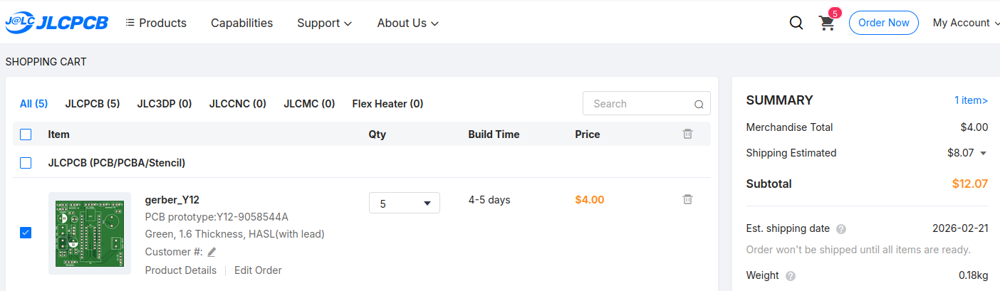
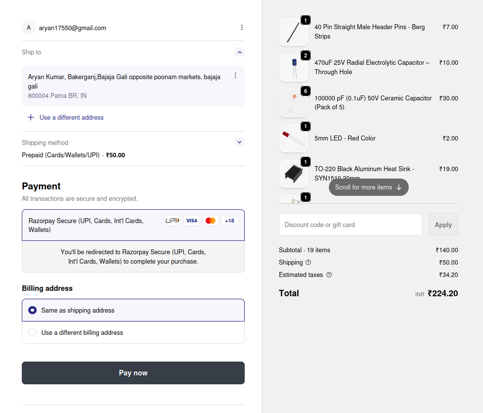
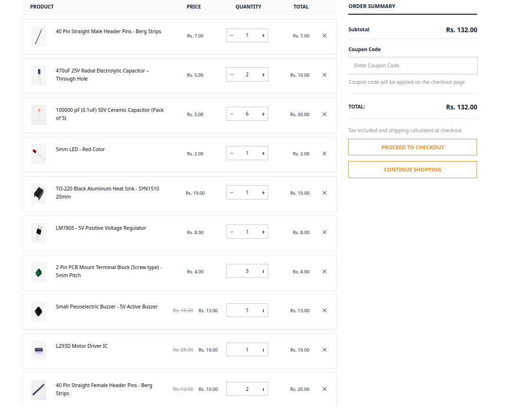
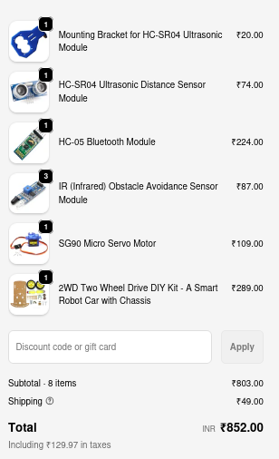

# For the Shield
|item name| quantity | description | link |cost|
|---------|----------|-------------|------|----|
|PCB manufacturing(5)|1 |production/gerber.zip|from jlcpcb|4 usd (360 rs)
|male header x 40|1|for connectors | https://quartzcomponents.com/products/40-pin-break-away-headers-straight-male-headers| 7 rs|
female hedaersx40|2|for arduino nano & conectors| https://quartzcomponents.com/products/40-pin-straight-female-berg-strips| 10 rs|
l293d|1 | motor driver ic | https://quartzcomponents.com/products/l293d-motor-driver-ic| 19 rs|
buzzer|1|buzzzz|https://quartzcomponents.com/products/piezo-buzzer|13 rs|
2 pin screw terminal|3| for motor outputs and power inputs| https://quartzcomponents.com/products/2-pin-pcb-mount-terminal-block-screw-type?variant=37646366474424&country=IN&currency=INR&utm_medium=product_sync&utm_source=google&utm_content=sag_organic&utm_campaign=sag_organic?utm_source=google&utm_medium=FreeListings| rs 4|
l7805|1|voltage regulator| https://quartzcomponents.com/products/lm7805-5v-positive-regulator?variant=31898041942151&country=IN&currency=INR&utm_medium=product_sync&utm_source=google&utm_content=sag_organic&utm_campaign=sag_organic?utm_source=google&utm_medium=FreeListings| rs 8 
mini heatsink for l7805| 1| to absorb the heat of the l7805| https://quartzcomponents.com/products/22-15-10mm-black-aluminum-heat-sink-for-to-220-package-power-transistor-cooling?variant=45643070800106&country=IN&currency=INR&utm_medium=product_sync&utm_source=google&utm_content=sag_organic&utm_campaign=sag_organic?utm_source=google&utm_medium=FreeListings| rs 19|
led|1|for the status| https://quartzcomponents.com/products/red-5mm-led| rs 2
100 nf ceramic| 6| for decoupling | https://quartzcomponents.com/products/10000-pf-0-1uf-ceramic-capacitor?variant=31898110197895&country=IN&currency=INR&utm_medium=product_sync&utm_source=google&utm_content=sag_organic&utm_campaign=sag_organic?utm_source=google&utm_medium=FreeListings| rs 5
470 uF electrolytic| 2| for safety| https://quartzcomponents.com/products/470-%C2%B5f-25v-radial-electrolytic-capacitor-through-hole?variant=45660873916650&country=IN&currency=INR&utm_medium=product_sync&utm_source=google&utm_content=sag_organic&utm_campaign=sag_organic?utm_source=google&utm_medium=FreeListings| rs 5

## cart: 

## Total(incl. of shipping, gst etc):
### rs 223(2.54 usd) + 1100 rs(12.07 usd) = 1323 rs(14.54 usd)
.        
.
# For the 2wd car:

|Item name | quantity| link | price|
|----------|---------|------|------|
|2wd chasis car set|1|https://robocraze.com/products/2wd-two-wheel-drive-diy-kit-a-smart-robot-car-with-chassis?variant=40192705036441&country=IN&currency=INR&utm_medium=product_sync&utm_source=google&utm_content=sag_organic&utm_campaign=sag_organic|rs 289
|servo|1|https://robocraze.com/products/sg90-micro-servo-motor?variant=40192525238425| rs 109
|ir sensor| 3 | https://robocraze.com/products/ir-proximity-sensor-1?variant=40192623640729&country=IN&currency=INR&utm_medium=product_sync&utm_source=google&utm_content=sag_organic&utm_campaign=sag_organic| rs 29
|HC-05|1|https://robocraze.com/products/hc-05-bluetooth-module?variant=40193264189593&country=IN&currency=INR&utm_medium=product_sync&utm_source=google&utm_content=sag_organic&utm_campaign=sag_organic|rs 224
|HC-SR04|1|https://robocraze.com/products/hc-sr-04-ultrasonic-sensor?variant=40192340983961&country=IN&currency=INR&utm_medium=product_sync&utm_source=google&utm_content=sag_organic&utm_campaign=sag_organic|rs 74|
|hc-sr04 mounting bracket| 1 | https://robocraze.com/products/mounting-bracket-for-hc-sr04-ultrasonic-module?variant=43394849112288&country=IN&currency=INR&utm_medium=product_sync&utm_source=google&utm_content=sag_organic&utm_campaign=sag_organic| rs 20|
|mpu6050|1|https://robocraze.com/products/mpu-6050-triple-axis-accelerometer-gyroscope-module?variant=40192322011289&country=IN&currency=INR&utm_medium=product_sync&utm_source=google&utm_content=sag_organic&utm_campaign=sag_organic|rs 175|

## cart:

## Total = 852 rs for the 2wd car components

# Total(inclduing the pcb, components and shield):
## PCB - 1100 rs
## Shield - 223 rs
## component = 852 rs
## Total = 2175 rs(23.86 usd)